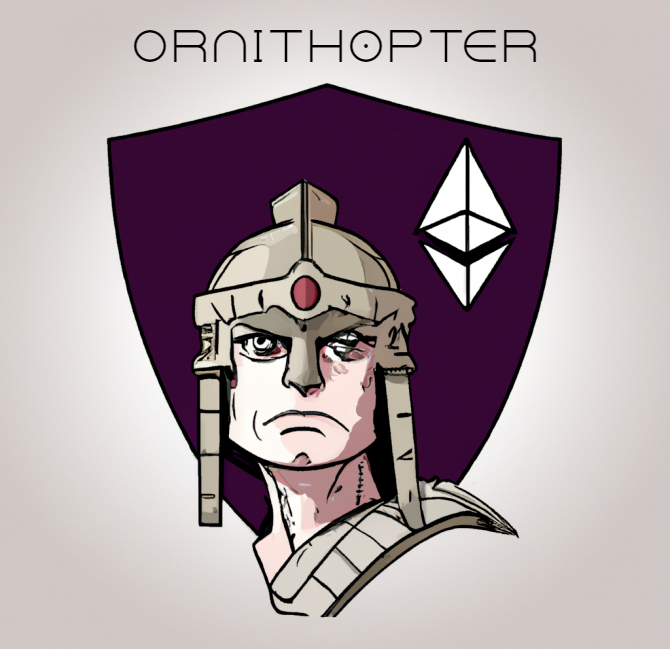

# Ornithopter

Ornithopter is a next-generation extension for Solidity. Ornithopter is closely integrated with [Foundry](https://github.com/foundry-rs/foundry) for many of its features, making it blazing fast. At the moment, Ornithopter can:
* Run all your tests through Forge with a single click via the VSCode Testing tab
* Do in-depth server-based code analysis to find even subtle bugs via the command `Analyze solidity`
* Build all your code with the command `Foundry: Build`
* Create a new Solidity project with a Forge template with the command `Foundry: Init`

Note:
* Ornithopther is primarily accessed via the VSCode command palette.
* Use `Ctrl+Shift+P` on Windows (or Linux) and `⇧+⌘+P` on a Mac

## Requirements
Install [Foundry](https://github.com/foundry-rs/foundry#installation) to get started.
